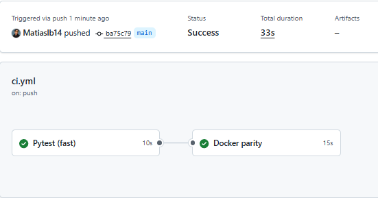
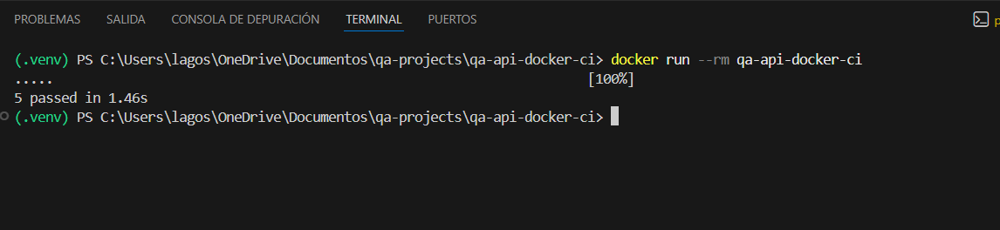

# QA API Testing – Pytest + Requests + Docker + GitHub Actions

## 📌 Descripción
Proyecto de **QA Automation** enfocado en la validación de una **API REST** utilizando **Pytest** y **Requests**, incorporando **Docker** y **GitHub Actions** para asegurar la ejecución consistente de los tests en distintos entornos.

El objetivo es construir un proyecto **completo pero no complejo**, orientado a un perfil **QA Automation Junior**, demostrando buenas prácticas de testing de APIs y nociones básicas de **CI / DevOps**.

Se utiliza una **API pública (JSONPlaceholder)** para simular un entorno real de pruebas sin dependencias de backend propio ni interfaz gráfica.

## ⭐ Características / Features Clave
- Automatización de pruebas de **APIs REST** con **Pytest**
- Validación de códigos de estado **HTTP**
- Validación de estructura y tipos de datos del **JSON**
- Manejo de escenarios positivos y negativos
- Configuración de **timeouts** para mayor estabilidad
- Implementación de **retry suave** para evitar flakiness por red
- Ejecución de tests:
  - Localmente
  - Dentro de **Docker**
  - En **CI con GitHub Actions**
- Proyecto enfocado en **paridad de entornos** (local, Docker y CI)

## 🧪 Qué se está probando
- Consumo de endpoints REST (`GET`)
- Respuestas exitosas (`200`)
- Validación de estructura mínima del **JSON**
- Validación de tipos de datos
- Manejo de errores ante endpoints inexistentes (`404`)
- Comportamiento ante recursos inexistentes
- Estabilidad de ejecución frente a fallos transitorios de red

## 🛠 Stack Tecnológico
- **Python**
- **Pytest**
- **Requests**
- **Docker**
- **GitHub Actions**
- API pública **JSONPlaceholder**

## 📂 Estructura del Proyecto
```text
qa-api-docker-ci/
├── tests/
│   ├── conftest.py
│   ├── test_posts.py
│   ├── test_contracts.py
│   └── test_negative.py
├── images/
│   ├── ci-pipeline.png
│   └── docker-run.png
├── config.py
├── pytest.ini
├── Dockerfile
├── requirements.txt
├── .github/
│   └── workflows/
│       └── ci.yml
├── .gitignore
└── README.md
```

## ▶️ Cómo ejecutar el proyecto

**Ejecución local**

```bash
# Clonar el repositorio e ingresar al proyecto
git clone https://github.com/Matiaslb14/qa-api-docker-ci.git
cd qa-api-docker-ci

# Crear y activar entorno virtual
python -m venv .venv
.\.venv\Scripts\Activate.ps1

# Instalar dependencias
pip install -r requirements.txt

# Ejecutar los tests
pytest
```

**Ejecución con Docker**
```bash
# Construir la imagen
docker build -t qa-api-docker-ci .

# Ejecutar los tests dentro del contenedor
docker run --rm qa-api-docker-ci
```

## ✅ Escenarios automatizados
- Obtención exitosa de recursos (`GET`)
- Validación de estructura y tipos de datos del JSON
- Respuesta `404` ante endpoints inexistentes
- Comportamiento ante IDs inexistentes
- Reintento automático ante fallos transitorios de red

## 🧠 Decisiones técnicas
- Se utiliza **JSONPlaceholder** como API pública para simular un entorno real de pruebas.
- Los tests priorizan **claridad, legibilidad y mantenibilidad** por sobre complejidad innecesaria.
- No se utiliza backend propio ni frameworks enterprise para mantener el foco en **QA Automation**.
- Se incorpora Docker para asegurar que los tests se ejecuten de la misma forma en cualquier entorno.
- La ejecución en **GitHub Actions** valida la correcta integración continua del proyecto.
- Se configura `pythonpath` en `pytest.ini` para asegurar imports estables entre local, Docker y CI.

## 📊 Reportes / Evidencia (cuando aplique)

- La ejecución de los tests se valida mediante la salida estándar de **Pytest**.
- El pipeline de **GitHub Actions** actúa como evidencia de ejecución exitosa en **CI**.
- Se incluyen capturas de:
  - Ejecución del pipeline en **GitHub Actions**
  - Ejecución de los tests dentro de un contenedor **Docker**

### CI – GitHub Actions


### Ejecución en Docker


## 📈 Mejoras futuras
- Ejecutar los tests en **matriz de versiones de Python** en GitHub Actions
- Agregar validaciones de **tiempos de respuesta** (performance básica)
- Incorporar ejecución programada (scheduled runs) en CI
- Generar reportes de ejecución automatizados en el pipeline